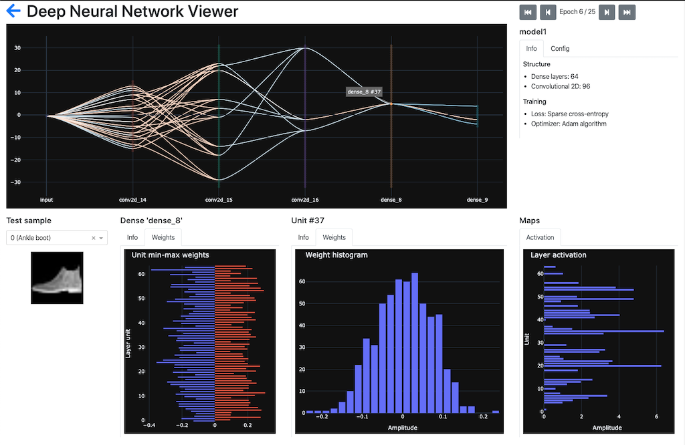
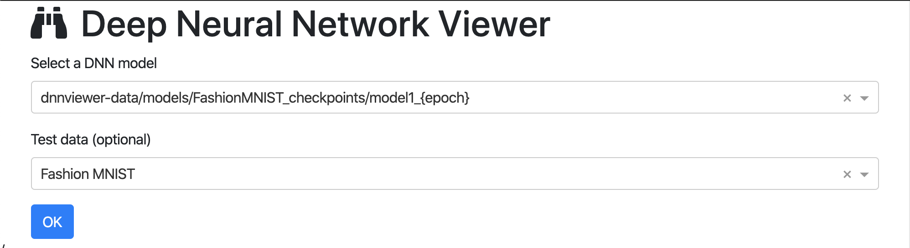

# Deep Neural Network viewer

A **dashboard to inspect deep neural network models**, providing interactive view on the layer and unit weights and gradients, as well as activation maps.

Current version is targeted at the **image classification**. However, coming version will target more diverse tasks.

This project is for learning and teaching purpose, do not try to display a network with hundreds of layers.



# Install

Install with PIP

```shell script
$ pip install dnnviewer
```

Run `dnnviewer` with one of the examples below, or with you own model (see below for capabilities and limitations)

Access the web application at http://127.0.0.1:8050


# Running the program

Currently accepted input formats are Keras Sequential models written to file in Checkpoint format or HDF5. A series of checkpoints along training epochs is also accepted as exemplified below.

Some test models are provided in the GIT repository `dnnviewer-data` to clone from Github or download a zip from the [repository page](https://github.com/tonio73/dnnviewer-data)

```shell script
$ git clone https://github.com/tonio73/dnnviewer-data.git
```

Test data is provided by Keras.

### Selecting the model within the application`

Launch the application with command line `--model-directories` that set a comma separated list of directory paths where the models are located

```shell
$ dnnviewer --model-directories dnnviewer-data/models,dnnviewer-data/models/FashionMNIST_checkpoints
```

Then select the network model and the corresponding test data (optional) on the user interface



Models containing the '{epoch}' tag are sequences over epochs. They are detected based on the pattern set by 
command line option `--sequence-pattern` whose default is `{model}_{epoch}

### Loading a single model

Keras models are loaded from Checkpoint or HDF5 format with option `--model-keras <file>`

#### CIFAR-10 Convolutional neural network

```shell
$ dnnviewer --model-keras dnnviewer-data/models/CIFAR-10_CNN5.h5 --test-dataset cifar-10
```

#### MNIST Convolutional neural network based on LeNet5

```shell
$ dnnviewer --model-keras dnnviewer-data/models/MNIST_LeNet60.h5 --test-dataset mnist
```

### Loading several epochs of a model

Series of models along training epochs are loaded using the argument `--sequence-keras <path>` and the pattern `{epoch}` within the provided path. See below on how to generate these checkpoints.

#### Fashion MNIST convolutionnal network

```shell
$ dnnviewer --sequence-keras "dnnviewer-data/models/FashionMNIST_checkpoints/model1_{epoch}" --test-dataset fashion-mnist
```

# Generating the models

## From Tensorflow 2.0 Keras

Note: Only Sequential models are currently supported.

### Save a single model

Use the `save()`method of _keras.models.Model_ class the output file format is either Tensorflow Checkpoint or HDF5 based on the extension. 

```python
model1.save('models/MNIST_LeNet60.h5')
```

### Save models during training

The Keras standard callback `tensorflow.keras.callbacks.ModelCheckpoint` is saving the model every epoch or a defined period of epochs:

```python
from tensorflow import keras
from tensorflow.keras.callbacks import ModelCheckpoint

model1 = keras.models.Sequential()
#...

callbacks = [
    ModelCheckpoint(
        filepath='checkpoints_cnn-mnistfashion/model1_{epoch}',
        save_best_only=False,
        verbose=1)
]

hist1 = model1.fit(train_images, train_labels, 
                   epochs=nEpochs, validation_split=0.2, batch_size=batch_size,
                   verbose=0, callbacks=callbacks)
```

# Current capabilities

- Load **Tensorflow Keras Sequential** models and create a display of the network
- Targeted at image classification task (assume image as input, class as output)
- Display series of models over training epochs
- Interactive display and unit weights through connections within the network and histograms
- Supported layers
  - Dense
  - Convolution 2D
  - Flatten
  - Input
- Ignored layers (no impact on the representation)
  - Dropout, ActivityRegularization, SpatialDropout1D/2D/3D
  - All pooling layers
  - BatchNormalization
  - Activation
- Unsupported layers
  - Reshape, Permute, RepeatVector, Lambda, Masking
  - Recurrent layers (LSTM, GRU...)
  - Embedding layers
  - Merge layers


# Developer documentation

See [developer.md](docs/developer.md)