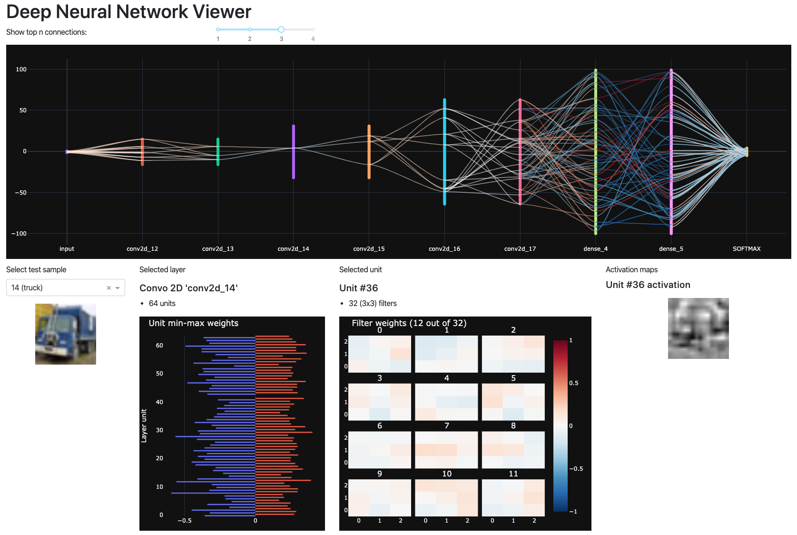

# Deep Neural Network viewer

A **dashboard to inspect deep neural network models**, providing interactive view on the layer and unit weights and gradients, as well as activation maps.

Current version is targeted at the **image classification**. However, coming version will target more diverse tasks.

This project is for learning and teaching purpose, do not try to display a network with hundreds of layers.



# Install

1. Clone the repository `git clone https://github.com/tonio73/dnnviewer.git` on your local machine
2. Using Conda or Pip, install the dependencies within your environment following the file [`environment.yml`](environment.yml)
3. Run `dnnviewer.py` with one of the examples below, or with you own model (see below for capabilities and limitations)
4. Access the web application at http://127.0.0.1:8050

# Running the program

Currently accepted input formats are Keras Sequential models written to file in Checkpoint format or HDF5. A series of checkpoints along training epochs is also accepted as exemplified below.

Test data is provided by Keras.

### Loading a single model

Keras models are loaded from Checkpoint or HDF5 format with option `--model-keras <file>`

#### CIFAR-10 Convolutional neural network

```shell
$ ./dnnviewer.py --model-keras stimuli/models/CIFAR-10_CNN5.h5 --test-dataset cifar-10
```

Larger model:

```shell
$ ./dnnviewer.py --model-keras stimuli/models/CIFAR-10_LeNetLarge.030.h5 --test-dataset cifar-10
```

#### MNIST Convolutional neural network based on LeNet5

```
$ ./dnnviewer.py --model-keras stimuli/models/MNIST_LeNet60.h5 --test-dataset mnist
```

#### MNIST Dense only neural network

```
$ ./dnnviewer.py --model-keras stimuli/models/MNIST_dense128.h5 --test-dataset mnist
```

### Loading several epochs of a model

Series of models along training epochs are loaded using the argument `--sequence-keras <path>` and the pattern `{epoch}` within the provided path. See below on how to generate these checkpoints.

#### Fashion MNIST convolutionnal network

```
$ ./dnnviewer.py --sequence-keras "stimuli/models/FashionMNIST_checkpoints/model1_{epoch}" --test-dataset fashion-mnist
```

# Generating the models

## From Tensorflow 2.0 Keras

Note: Only Sequential models are currently supported.

### Save a single model

Use the `save()`method of _keras.models.Model_ class the output file format is either Tensorflow Checkpoint or HDF5 based on the extension. 

```python
model1.save('models/MNIST_LeNet60.h5')
```

### Save models during training

The Keras standard callback `tensorflow.keras.callbacks.ModelCheckpoint` is saving the model every epoch or a defined period of epochs:

```python
from tensorflow.keras.callbacks import ModelCheckpoint

callbacks = [
    ModelCheckpoint(
        filepath='checkpoints_cnn-mnistfashion/model1_{epoch}',
        save_best_only=False,
        verbose=1)
]

hist1 = model1.fit(train_images, train_labels, 
                   epochs=nEpochs, validation_split=0.2, batch_size=batch_size,
                   verbose=0, callbacks=callbacks)
```

# Current capabilities

- Load **Tensorflow Keras Sequential** models and create a display of the network
- Targeted at image classification task (assume image as input, class as output)
- Display series of models over training epochs
- Interactive display and unit weights through connections within the network and histograms
- Supported layers
  - Dense
  - Convolution 2D
  - Flatten
  - Input
- Ignored layers (no impact on the representation)
  - Dropout, ActivityRegularization, SpatialDropout1D/2D/3D
  - All pooling layers
  - BatchNormalization
  - Activation
- Unsupported layers
  - Reshape, Permute, RepeatVector, Lambda, ActivityRegularization, Masking
  - Recurrent layers (LSTM, GRU...)
  - Embedding layers
  - Merge layers

# Software architecture

The application is based on Dash for the user interface management (which is generating ReactJs components), and Plotly for the data visualization.

Code is separated in two branches:

- The Graphical representation
- Adapters to read existing models, currently only supporting Keras

### Code quality

- Code is PEP8 compliant, thanks to *flake8* and *Intellij* for watching
- There are a few pytest unit tests in `unittests/`

#### Run unit test

From project root directory:

```shell
$ python -m pytest
```

#### Code linting

```shell
$ flake8  --max-line-length=120
```

